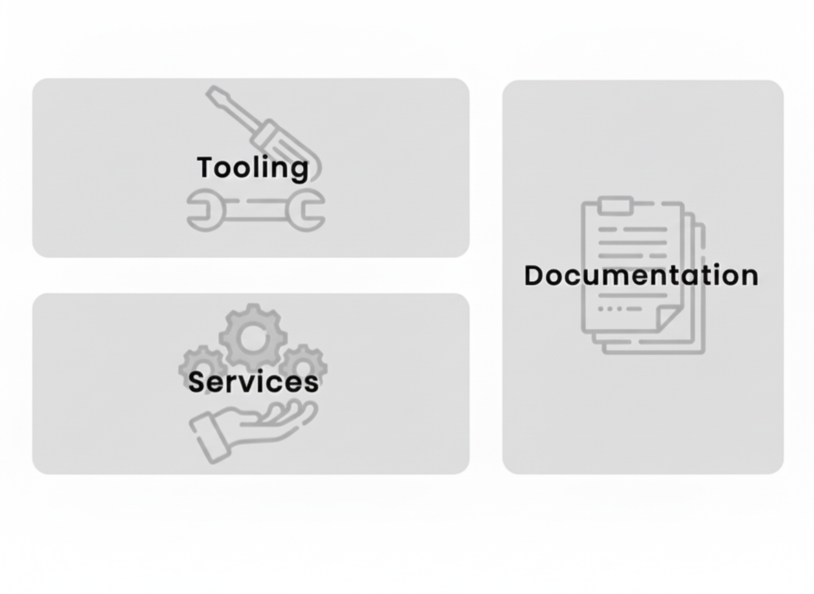

### Backstage

> 💡 **Notes :**  
> Grâce à cette centralisation, les équipes gagnent du temps, réduisent la complexité et gardent une meilleure visibilité sur ce qu’elles possèdent.  
>  
> En résumé, Backstage aide à structurer votre écosystème logiciel, pour un environnement de développement plus clair, plus cohérent et plus facile à maintenir.
